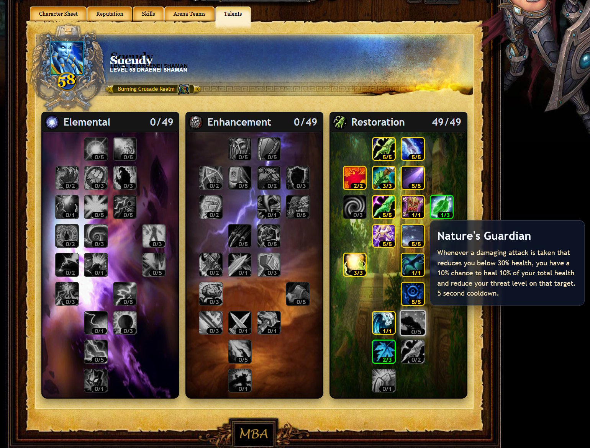
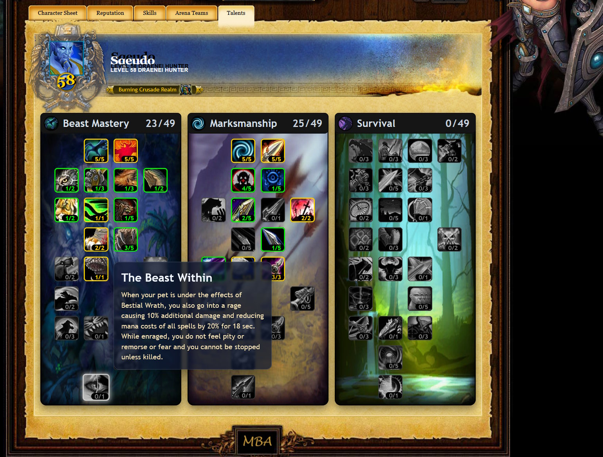
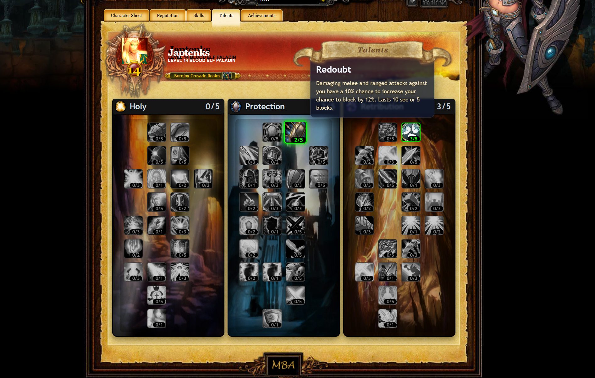
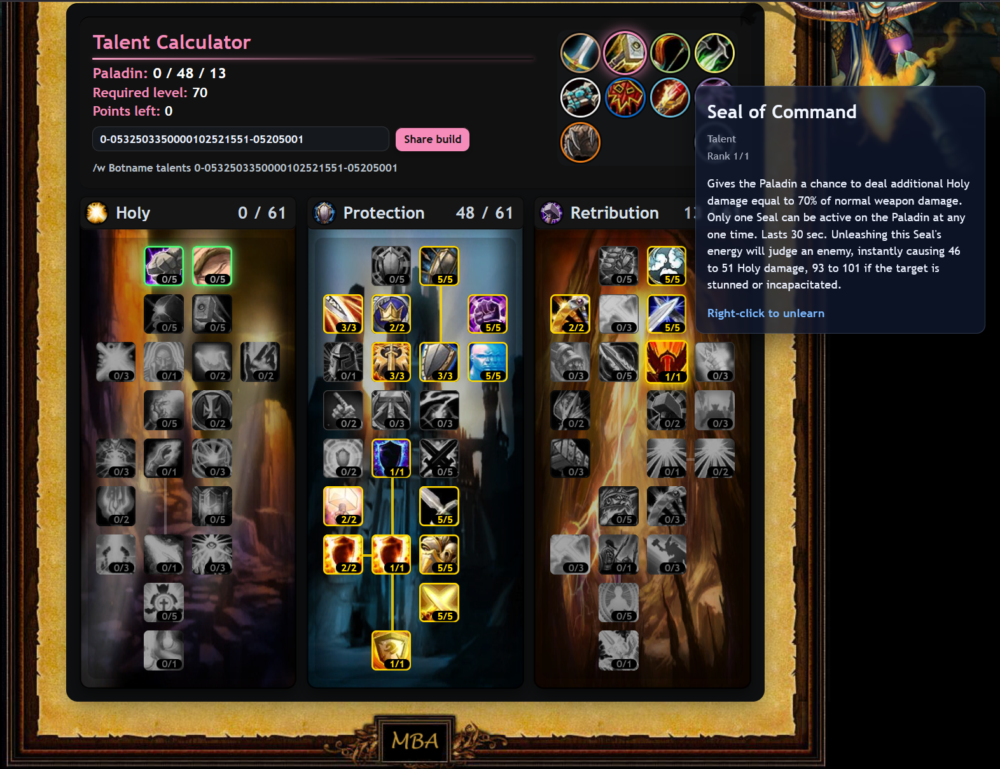
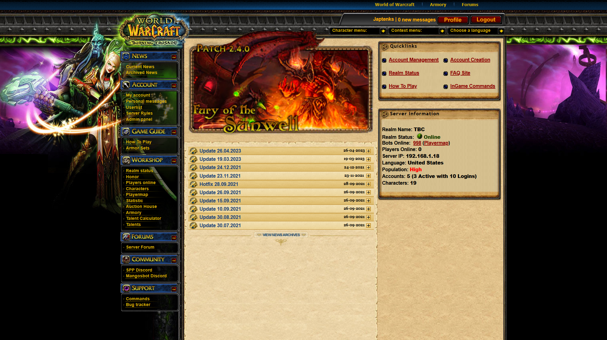
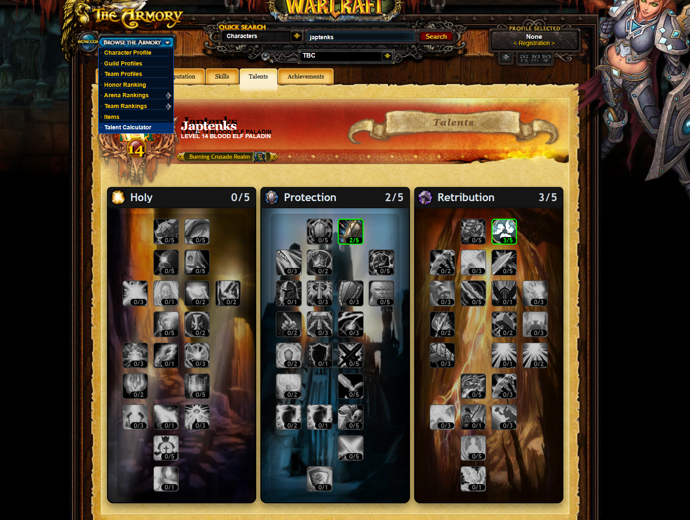

\# SPP-Armory-Website

Website with working Armory for the [SPP Classics Repack](https://github.com/celguar/spp-classics-cmangos).

\# Features

- Auto-builds **Talent Trees** for different classes from the armory database  
  *(uses `dbc_talent` and `dbc_talenttab`)*  

- Tooltips update dynamically from the DBC  
  *(pulls values like `spells`, `duration`, `icon`, `radius`)* 

-Talent Calculator for all Classes
	-Allows for importing a hash from wowhead. armory/index.php#2-02-02
	will take you to the Paladin Talent calculator, with 2 points in each tree
-New links to navigate the website

-Armor set page - WIP

---

\## Installation

1\. Copy over the currently installed website located at `.\Server\website`

2\. Run `dbc\_spell field updates.sql` on your `classicarmory` or `tbcmarmory` database  

&nbsp;  \*(adds 3 new fields)\*.

3\. Refresh the website.

---

\### Talent Trees

**Shaman**

**Hunter**

**Paladin**

**Updated Banner - Talents**

**Talent Calculator - Paladin**

Can import the same hash from WowHead's talent calculator.
The share build, will pull the hash code for the current build.
There is a /w botname spot, with the command to have a bot use this talent build. 

**Start page with new Links under Workshop and Gameguide**

Talents - Takes you to your selected account character. (If logged in)
Talent Calculator - Take you to new character talent calculator.

**New Link under the Armory dropdown**

---

\## Notes

\- The `img/` folder is \*\*not included\*\* in release zips (set via `.gitattributes`).

