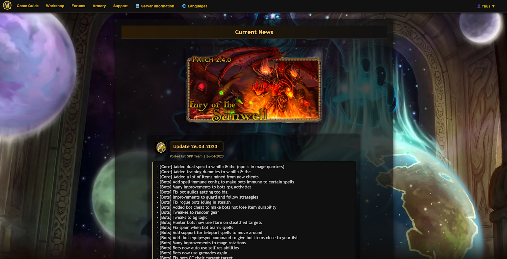
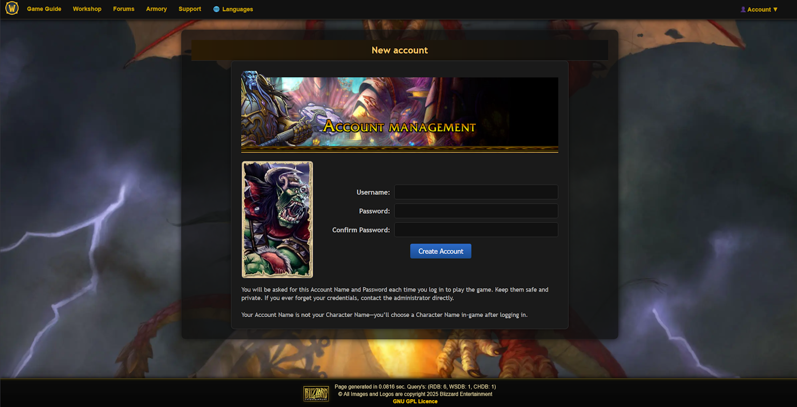
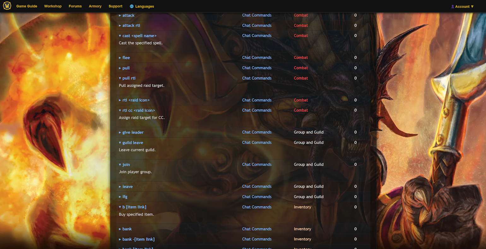
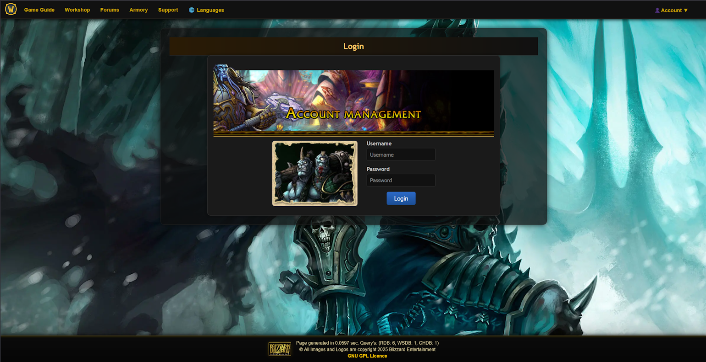
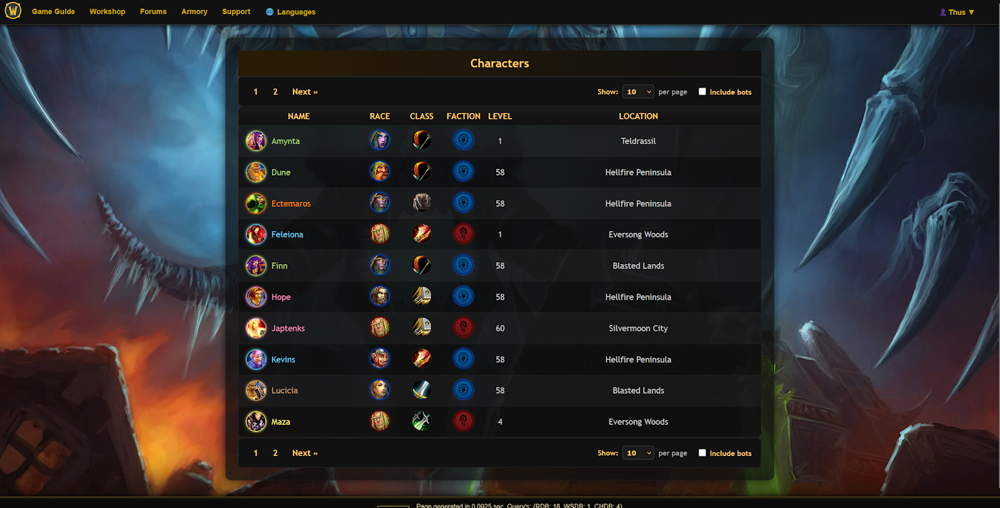
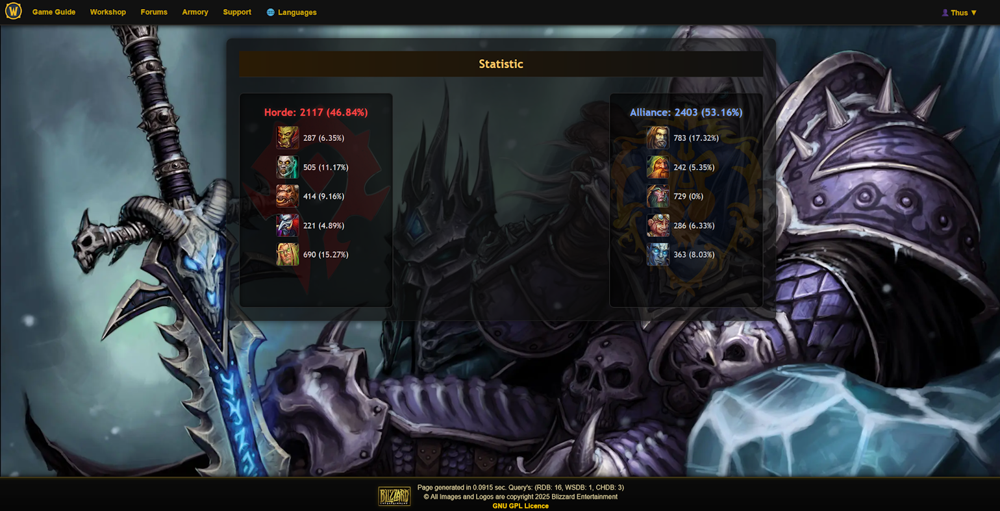

# SPP-Armory-Website 2026 Refresh
**Site Redesign**

<video src="img/WebShowcase.mp4" controls width="800"></video>



Website for the [SPP Classics Repack](https://github.com/celguar/spp-classics-cmangos). Windows \
Website for the [SPProxmox launcher](https://github.com/japtenks/spp-cmangos-prox) Proxmox

\# Features

- Auto-builds **Talent Trees** for different classes from the armory database  
  *(uses `dbc_talent` and `dbc_talenttab`)*  

- Tooltips update dynamically from the DBC  
  *(pulls values like `spells`, `duration`, `icon`, `radius`)* 

-Talent Calculator for all Classes
	-Allows for importing a hash from wowhead. armory/index.php#2-02-02
	will take you to the Paladin Talent calculator, with 2 points in each tree
-New links to navigate the website

-Armor set pages, bot command page, character page redesign and much more. 

---


\## Installation


1\. Download the most recent code. 
```
https://github.com/japtenks/SPP-Armory-Website/releases/tag/v1.1
```
or clone the git respository

2\. Extract and copy over the currently installed website located at `.\Server\website` 
Ensure the web server is shutdown.

3\. Using Heidi or similar. Open and run the associated DB updates files are located in `website\DB updates`.

4\. Verify Database connection infomation in `\website\config\config-protected.php`
```
$db = [
    'host' => '127.0.0.1',
    'port' => 3301,
    'user' => 'root',
    'pass' => '123456'
];
```
5\. Refresh the website.


---

**New registration page - no more fuss with questions**


**New Bot Command Interactive Search **


**New Login**


**New Character List with bot filter**


**New**

---


