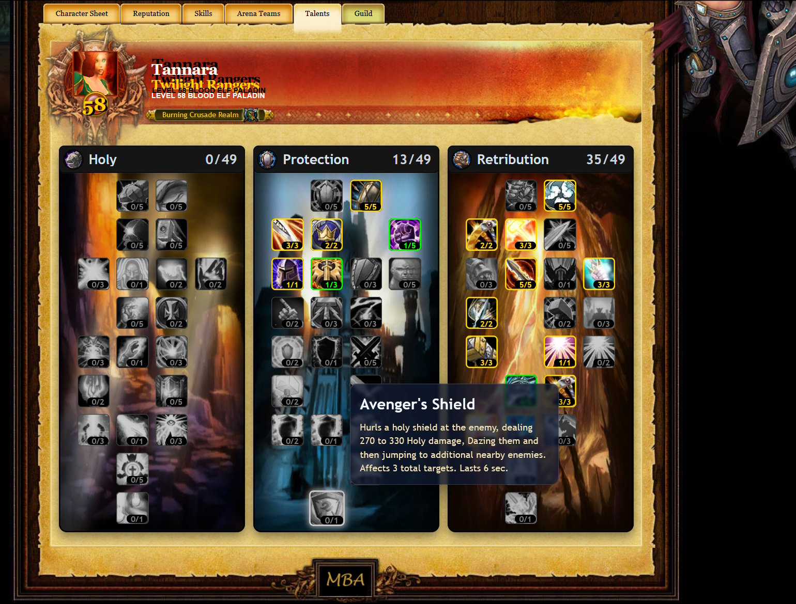

\# SPP-Armory-Website

Website with working Armory for the [SPP Classics Repack](https://github.com/celguar/spp-classics-cmangos).

\# Features

- Auto-builds **Talent Trees** for different classes from the armory database  
  *(uses `dbc_talent` and `dbc_talenttab`)*  

- Tooltips update dynamically from the DBC  
  *(pulls values like `spells`, `duration`, `icon`, `radius`)*  

---

\## Installation

1\. Copy over the currently installed website located at `.\Server\website`

2\. Run `dbc\_spell field updates.sql` on your `classicarmory` or `tbcmarmory` database  

&nbsp;  \*(adds 3 new fields)\*.

3\. Refresh the website.

---

\### Talent Trees

**Shaman**

**Hunter**

**Paladin**

---

\## Notes

\- The `img/` folder is \*\*not included\*\* in release zips (set via `.gitattributes`).

